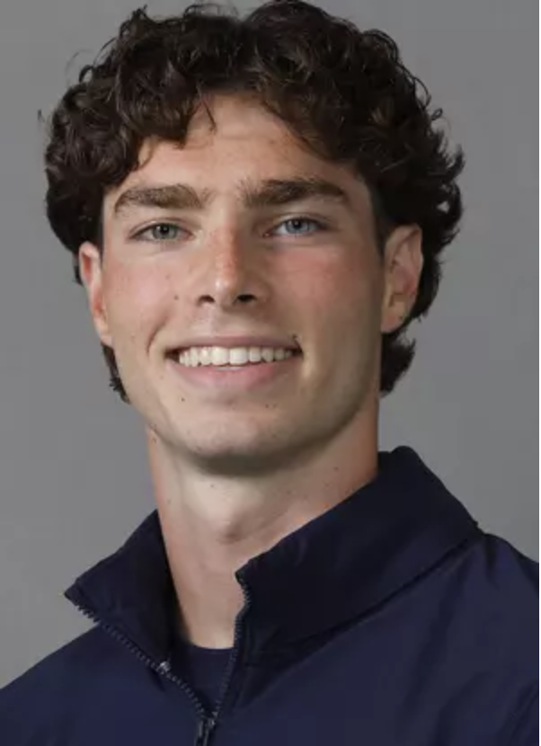

# Aidan Rikic

## About Me

Hey! I'm a senior at **UC San Diego** studying *Cognitive Science with a Machine Learning focus* and a Computer Science minor.
Outside of class, I'm a Division I swimmer and former team captain for the Tritons. Swimming has been a huge part of my life and has shaped how I approach challenges both in and out of the water.

I grew up playing basketball and still play recreationally because it's one of my favorite activities. I also love spending my time outdoors whether it's on a hike, at the beach, playing golf, or just roaming around the city and seeing new places. 

One of my favorite quotes:
> "The best way to predict the future is to build it."

---

## Skills & Interests

### My favorite languages (right now)
1. GoLang
2. `Python`
3. SQL

Jump to [what I'm learning next](#things-i-want-to-learn-next)

### Technical
- Machine learning and AI systems
- Mobile and full-stack development
- Data analysis and visualization

---

## Things I want to learn next
- [ ] Go deeper on into neural networks and reinforcement learning
- [ ] Contribute to an open source ML project
- [x] Build and deploy a full-stack mobile app

---

## Connect

Feel free to reach out — I'm always open to talking tech, swimming, or basketball.

[LinkedIn →](https://www.linkedin.com/in/aidan-rikic/)